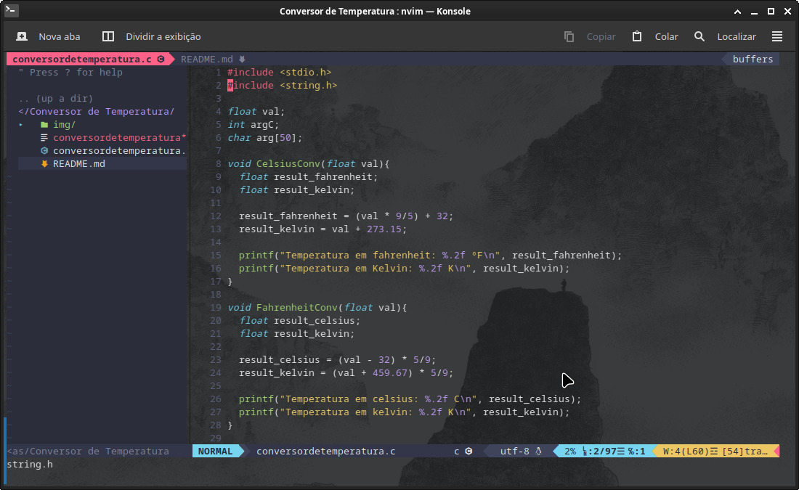

# NeoVim Configs

#### Here all my NeoVim file configs (init.vim).
#### If you want to use this configs, follow the steps bellow:

    

##### 1. Copy `init.vim` file.
##### 2. Past `init.vim` file in your NeoVim config directory.
##### 3. If you have another `init.vim` file in your NeoVim directory, please make sure you remove it first.
##### 4. Run your NeoVim in the normal mode (command mode), use the command `:PlugInstall` to install the NeoVim plugins.
##### 5. It's ready to the show. :)

#### This config files is based in the config file of the youtube channel `Manual do Código`.

### If you have made some modifications in these configs, please share it with the comunit.
